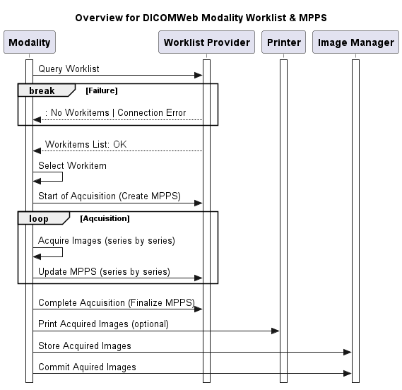

## Content 
Folder contains a list of:
- plantuml files desdcribing the different use cases (starting with a overview)
- http files containing examples for different calls

## Overview of main use case
Main use case shows the interaction of an modality with a worklist provider and a Printer and Image Manager. 

## Examples for the single steps using DICOMWeb
- [Retrieve Worklist](10-Retrieve-Worklist.md) 

## Definitions
The **UPS Push SOP Class** allows SCU systems to:
- create (push) a new worklist item (i.e., instance) onto a worklist
- submit a cancellation request for a worklist item

The **UPS Pull SOP Class** allows SCU systems to:
- query a worklist for matching items
- take responsibility for performing a worklist item
- add/modify progress/status/result details for the worklist item
- finalize a controlled worklist item as Completed or Canceled.

The **UPS Watch SOP Class** allows SCU systems to:
- query for worklist items of interest
- subscribe/unsubscribe for event notifications of changes to a given worklist item
- subscribe/unsubscribe for event notifications of all worklist items
- get details for a given worklist item
- submit a cancellation request for a given worklist item

The **UPS Event SOP Class** allows SCU systems to:
- receive event notifications of changes to a worklist item

The **UPS Query SOP Class** allows SCU systems to:
- query a worklist for matching items.

## Useful links
#### Workflows in hospital
https://hackmd.io/@victoriatjia/fhir-radiology#11-Current-Radiology-Workflow-in-Hospital

#### DIMSE Modality Worklist
https://dicom.nema.org/medical/dicom/current/output/chtml/part04/sect_k.6.html
Matching keys
https://dicom.nema.org/medical/dicom/current/output/chtml/part04/sect_K.6.html#table_K.6-1

#### DIMSE MPPS
https://dicom.nema.org/medical/dicom/current/output/chtml/part04/sect_F.7.2.html#sect_F.7.2.1

#### DIMSE DICOM UPS
https://dicom.nema.org/medical/dicom/current/output/chtml/part04/sect_cc.3.html
UPS attributes
https://dicom.nema.org/medical/dicom/current/output/html/part04.html#table_CC.2.5-3

#### DICOM WEB UPS
https://dicom.nema.org/medical/dicom/current/output/html/part18.html#chapter_11
https://www.dicomstandard.org/using/dicomweb/workflow-ups-rs

#### Mapping DMWL to UPS
IHE_RAD_Suppl_EBIW.pdf
Table 4.130.4.1.2-1: Return and Matching Keys for Encounter Metadata

#### DMWL & MPPS examples
https://pydicom.github.io/pynetdicom/dev/examples/qr_find.html

#### UPS content
https://dicom.nema.org/dicom/2013/output/chtml/part03/sect_B.26.html
