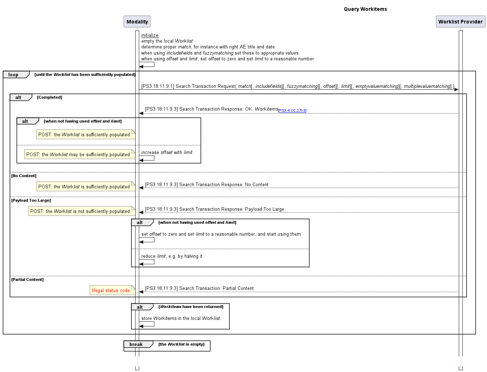

# DICOMweb Modality Services
## Content 
This repository contains a description on how to do the equivalence of DIMSE [MWL](https://dicom.nema.org/medical/dicom/current/output/chtml/part04/sect_k.6.html) & [MPPS](https://dicom.nema.org/medical/dicom/current/output/chtml/part04/sect_F.7.2.html#sect_F.7.2.1) in a RESTful manner, based on the [DICOMWeb Worklist Service (UPS-RS)](https://dicom.nema.org/medical/dicom/current/output/chtml/part18/chapter_11.html). This equivalence is called DICOMweb Modality Services.
In addition there are different examples integrated.

## Prerequisites
### Tools
In order to extend this repository the following software needs to be installed:
- [Studio Code](https://code.visualstudio.com/)
- [Extension PlantUML](https://marketplace.visualstudio.com/items?itemName=jebbs.plantuml)

Every plantuml diagram can be exported to folder 'diagrams' by using the right mouse click on a plantuml file and selecting *Export Workspace Diagrams*.
However, to do so proper settings on the *PlantUML Extension* are required (press the cogwheel of the PlanUML extension to edit these):
- select *Export Format* the entry *png*
- unselect *Export Include Folder Hierarchy* (misspelled in the settings as 'Heirarchy' and 'heiracrchy')
- type in *Export Out Dir* the folder *diagrams* as main folder containg the diagrams
- unselect *Export Sub Folder*

## Use Cases
The main use case of DICOMweb Modality Services shows the interaction of a Modality with a Worklist Provider, Printer and Image Manager. The scope of this repository is the interaction between several actors with the Worklist Provider.

Another use case in scope is about acquisition modalities in the context of encounter-based imaging, namely when there is no Workitem for the imaging performed. These modalities would need to create a Workitem themselves, in line with the [IHE EBIW integration profile]().

Furthermore, there are also dashboard-like applications that want to show the progress of the Workitems, or applications that base there behavior on work being done by some other device or application. Both of these require notifications on the status of Workitems.

## Mapping the DIMSE MWL & MPPS commands to DICOMWeb Worklist Service Transactions and Requests
| MWL & MPPS | Worklist Service Transaction | Worklist Service Request |
|-------------|--------|----------|
| C-FINDMWL | Search [ & Retrieve Workitem ] | GET {s}/workitems{?query*} [ & GET {s}/workitems/{instance} ]  |
| N-CREATEMPPS | Change Workitem State [ & Update Workitem ] | PUT {s}/workitems/{instance}/state [ & POST {s}/workitems/{instance}{?transaction} ] |
| N-SETMPPS | Update Workitem | POST {s}/workitems/{instance}{?transaction}  |
| N-GETMPPS | Retrieve Workitem | GET {s}/workitems/{instance} |
| N-EVENT-REPORTMPPS | Subscribe Transaction | POST {s}/workitems/{instance}/subscribers/{aetitle} |

## Happy Flow

An overview of the happy flow is given below, where the User Agent is typically an Acquisition Modality, while the Origin Server would be a RIS or the like:

## Examples for the single steps using DICOMWeb
- **Query Worklist:** modality retrieves the worklist items (correlates to DIMSE MWL C-FIND)

[Example: Query Worklist](10-Query-Worklist.md) 

- **Retrieve Single Workitem** (optional, if not all information was delivered by query transaction)

[Retrieve Workitem (optional)](11-Retrieve-Workitem.md)

- **Start Acquisition** the modality claimes the workitem and starts the acquisition

[Start Acquisition](12-Start-Acquisition.md)

- **Update Workitem** the modality updates the workitem with information for each produced series

[Update Workitem](13-Update-MPPS.md)

- **Complete Acquisition** the modality completes the acquisition and completes the study

[Complete Acquisition](14-Complete-Acquisition.md)

## Definitions
The **UPS Push SOP Class** allows SCU systems to:
- create (push) a new worklist item (i.e., instance) onto a worklist
- submit a cancellation request for a worklist item

The **UPS Pull SOP Class** allows SCU systems to:
- query a worklist for matching items
- take responsibility for performing a worklist item
- add/modify progress/status/result details for the worklist item
- finalize a controlled worklist item as Completed or Canceled.

The **UPS Watch SOP Class** allows SCU systems to:
- query for worklist items of interest
- subscribe/unsubscribe for event notifications of changes to a given worklist item
- subscribe/unsubscribe for event notifications of all worklist items
- get details for a given worklist item
- submit a cancellation request for a given worklist item

The **UPS Event SOP Class** allows SCU systems to:
- receive event notifications of changes to a worklist item

The **UPS Query SOP Class** allows SCU systems to:
- query a worklist for matching items.

## Useful links
#### Workflows in hospital
https://hackmd.io/@victoriatjia/fhir-radiology#11-Current-Radiology-Workflow-in-Hospital

#### DIMSE Modality Worklist
https://dicom.nema.org/medical/dicom/current/output/chtml/part04/sect_k.6.html
Matching keys
https://dicom.nema.org/medical/dicom/current/output/chtml/part04/sect_K.6.html#table_K.6-1

#### DIMSE MPPS
https://dicom.nema.org/medical/dicom/current/output/chtml/part04/sect_F.7.2.html#sect_F.7.2.1

#### DIMSE UPS
https://dicom.nema.org/medical/dicom/current/output/chtml/part04/sect_cc.3.html
UPS attributes
https://dicom.nema.org/medical/dicom/current/output/html/part04.html#table_CC.2.5-3

#### DICOMweb UPS
https://dicom.nema.org/medical/dicom/current/output/html/part18.html#chapter_11
https://www.dicomstandard.org/using/dicomweb/workflow-ups-rs

#### Mapping DICOM MWL to UPS
[IHE_RAD_Suppl_EBIW.pdf](https://eur04.safelinks.protection.outlook.com/?url=https%3A%2F%2Fwww.ihe.net%2FuploadedFiles%2FDocuments%2FRadiology%2FIHE_RAD_Suppl_EBIW.pdf%23page%3D61&data=05%7C01%7Cdieter.krotz%40siemens-healthineers.com%7C1f152786c550400ada1a08db1fcac085%7C5dbf1add202a4b8d815bbf0fb024e033%7C0%7C0%7C638138728255656972%7CUnknown%7CTWFpbGZsb3d8eyJWIjoiMC4wLjAwMDAiLCJQIjoiV2luMzIiLCJBTiI6Ik1haWwiLCJXVCI6Mn0%3D%7C3000%7C%7C%7C&sdata=NrIebDyqLlLYrPjhjR8tAh5KyYjyS017IiLYe5%2FGfxM%3D&reserved=0)
Table 4.130.4.1.2-1: Return and Matching Keys for Encounter Metadata

#### DICOM MWL & MPPS examples
https://pydicom.github.io/pynetdicom/dev/examples/qr_find.html

#### UPS content
https://dicom.nema.org/dicom/current/output/chtml/part03/sect_B.26.html
